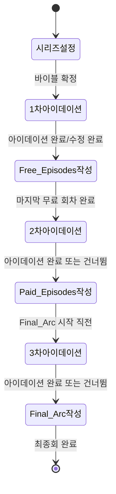

# 디자인 문서: NCP 숏폼 스킬 업그레이드

## 개요

현재 `.claude/skills/ncp-shortform/SKILL.md`는 단일 흐름으로 에피소드를 순차 작성하는 구조다.
이번 업그레이드의 목표는 **3단계 아이데이션 구조**를 도입하여, 숏폼 드라마의 구간별 기획 특성(무료 훅 → 유료 심화 → 결말 확정)을 SKILL.md 지침 안에서 자연스럽게 지원하는 것이다.

이 프로젝트의 결과물은 코드가 아니라 **SKILL.md 파일 자체**다. 디자인 문서는 업그레이드된 SKILL.md의 구조, 각 섹션의 내용, 그리고 Claude가 따라야 할 행동 규칙을 상세히 설계한다.

### 핵심 변경 사항 요약

| 항목 | 현재 | 업그레이드 후 |
|------|------|--------------|
| 아이데이션 | 없음 | 3단계 (1차/2차/3차) |
| 시리즈 설정 | 전체 회차만 | 전체 회차 + 구간 경계값 |
| NCP ideation 필드 | 미사용 | 각 단계 결과물로 출력 |
| 에피소드 JSON | ideation 필드 없음 | story.ideation 포함 |
| 단계 전환 | 없음 | 자동 감지 + 안내 |
| 진행 상황 표시 | 없음 | 매 회차 한 줄 표시 |
| 이야기 연속성 | 없음 | Continuity_Bridge — 단계 전환 시 이전 노드 리뷰 + 연결 선언 강제 |

---

## 아키텍처

### SKILL.md 전체 구조 (업그레이드 후)

```
# 숏폼 드라마 시리즈 작성 어시스턴트

[역할 선언]
[입력값]

## 숏폼 드라마의 핵심 원칙
## NCP 스키마 핵심 규칙

## 진행 방식

### 1단계: 시리즈 설정 커스터마이징
  - 기존 기초 설정 항목
  - [신규] Series_Config 설정 (구간 경계값)
  - 시리즈 바이블 출력 형식 (Series_Config 포함)

### 2단계: 1차 아이데이션 — 무료 회차 기획
  - [신규] 아이데이션 탐색 항목
  - [신규] Ideation_Node 출력 형식
  - [신규] ideation-phase1.json 저장 안내

### 3단계: 에피소드 순차 작성 (Free_Episodes)
  - 기존 A~E 흐름 유지
  - [신규] 진행 상황 한 줄 표시
  - [신규] story.ideation 필드 포함
  - [신규] 오류 방지 체크리스트에 ideation 항목 추가

### 4단계: 2차 아이데이션 — 유료 회차 기획
  - [신규] 전환 감지 조건
  - [신규] Continuity_Bridge — 1차 핵심 노드 리뷰 + 연결 선언
  - [신규] 아이데이션 탐색 항목
  - [신규] id 중복 방지 규칙
  - [신규] ideation-phase2.json 저장 안내

### 5단계: 에피소드 순차 작성 (Paid_Episodes)
  - 3단계와 동일 흐름

### 6단계: 3차 아이데이션 — 최종 결말 기획
  - [신규] 전환 감지 조건
  - [신규] Continuity_Bridge — 1차+2차 핵심 노드 리뷰 + 연결 선언
  - [신규] outcome/judgment 확정 탐색
  - [신규] ideation-phase3.json 저장 안내

### 7단계: 에피소드 순차 작성 (Final_Arc)
  - 3단계와 동일 흐름

## 시리즈 arc 관리
## 오류 방지 체크리스트
```

### 상태 전이 다이어그램



---

## 컴포넌트 및 인터페이스

### 1. Series_Config 컴포넌트

시리즈 설정 단계에서 확정되는 구성 값. 이후 모든 단계에서 참조된다.

**설정 항목:**

| 필드 | 설명 | 기본값 |
|------|------|--------|
| `total_episodes` | 전체 회차 수 | 사용자 입력 필수 |
| `phase1_end` | 1차 아이데이션 구간 마지막 회차 | 10 |
| `final_arc_offset` | 최종회 이전 N회부터 Final_Arc 시작 | 10 |

**파생 값 (자동 계산):**

```
free_episodes_range   = 1 ~ phase1_end
paid_episodes_range   = (phase1_end + 1) ~ (total_episodes - final_arc_offset)
final_arc_range       = (total_episodes - final_arc_offset + 1) ~ total_episodes
```

**유효성 검사 규칙:**
- `phase1_end < total_episodes - final_arc_offset` 이어야 함
- `final_arc_offset < total_episodes` 이어야 함
- 위반 시 오류 메시지와 함께 재입력 요청

**시리즈 바이블 출력 형식 (업그레이드):**

```
시리즈: [제목] (총 [N]회)
장르: [장르]
MC: [이름] — [설명]
IC: [이름] — [설명]
시리즈 결말: outcome=[success/failure], judgment=[good/bad]
에피소드 길이: [90/120]초

[시리즈 구간]
- 무료 구간 (1차 아이데이션): 1~[phase1_end]회
- 유료 구간 (2차 아이데이션): [phase1_end+1]~[total-final_arc_offset]회
- 최종 결말 구간 (3차 아이데이션): [total-final_arc_offset+1]~[total]회
```

---

### 2. Ideation_Phase 컴포넌트

각 아이데이션 단계의 공통 인터페이스.

**공통 구조:**

```
[아이데이션 단계 헤더]
  - 현재 단계 번호 (1차/2차/3차)
  - 해당 구간 회차 범위
  - 탐색 목표 설명

[탐색 항목]
  - character 노드들
  - theme 노드들
  - plot 노드들
  - genre 노드들

[Ideation_JSON 출력]
  - NCP ideation 구조 준수
  - id 중복 방지 (2차, 3차)

[저장 안내]
  - 파일명 지정
  - 검증 명령어 안내
```

**단계별 탐색 초점:**

| 단계 | 탐색 초점 | 저장 파일 |
|------|-----------|-----------|
| 1차 | 무료 구간 훅, 캐릭터 소개, 핵심 갈등 씨앗 | `examples/ideation-phase1.json` |
| 2차 | 갈등 심화, 캐릭터 관계 변화, 중간 반전 | `examples/ideation-phase2.json` |
| 3차 | 결말 방향, 캐릭터 최종 변화, outcome/judgment 확정 | `examples/ideation-phase3.json` |

---

### 3. 진행 상황 표시 컴포넌트

매 회차 작성 시작 시 한 줄로 표시.

**형식:**

```
[진행] [N]회 / 총 [total]회 | 현재 구간: [무료/유료/최종결말] | 아이데이션: [1차/2차/3차] 완료
```

**예시:**

```
[진행] 11회 / 총 60회 | 현재 구간: 유료 | 아이데이션: 2차 완료
```

---

### 4. 단계 전환 감지 컴포넌트

에피소드 작성 흐름 안에서 자동으로 전환 시점을 감지하고 사용자에게 안내한다.

**전환 조건:**

| 전환 시점 | 감지 조건 | 안내 내용 |
|-----------|-----------|-----------|
| 1차 → 2차 | 현재 회차 = `phase1_end` 완료 후 | "2차 아이데이션을 시작할까요?" |
| 2차 → 3차 | 현재 회차 = `total_episodes - final_arc_offset` 완료 후 | "3차 아이데이션을 시작할까요?" |

**건너뜀/되돌아가기 처리:**
- 건너뜀: 즉시 다음 구간 에피소드 작성 진행
- 되돌아가기: 현재 상태(회차, 단계) 안내 후 해당 아이데이션 단계로 복귀

---

### 5. Continuity_Bridge 컴포넌트

아이데이션 단계 전환 시 이야기 연속성을 보장하기 위한 핵심 메커니즘. 2차/3차 아이데이션을 시작하기 전에 반드시 실행된다.

**목적:** 새 아이데이션 단계가 이전 단계의 캐릭터, 갈등, 테마를 이어받아 이야기가 단절되지 않도록 강제한다.

---

#### 2차 아이데이션 진입 시 Continuity_Bridge

1차 아이데이션 완료 후, 2차 탐색 전에 다음 리뷰를 출력한다:

```
━━━ 연속성 브리지: 1차 → 2차 ━━━

[1차에서 확립된 것]
캐릭터: [1차 character 노드 핵심 요약 — 이름, 욕망, 결핍]
핵심 갈등 씨앗: [1차 plot 노드 중 미해결로 남긴 것]
테마 방향: [1차 theme 노드 핵심]
무료 구간 마지막 훅: [phase1_end회의 결말 — 시청자가 유료로 넘어오게 만든 요소]

[2차에서 이어받아야 할 것]
- 위 갈등 씨앗이 어떻게 심화되는가?
- 캐릭터 관계가 어떤 방향으로 변화하는가?
- 테마가 어떻게 복잡해지는가?

위 내용을 바탕으로 2차 아이데이션을 시작합니다.
━━━━━━━━━━━━━━━━━━━━━━━━━━━━━━
```

새 노드 생성 시 연결 출처 기록 규칙:
- 1차 노드를 직접 이어받는 경우: `"notes": "1차 [원본_id] 에서 심화"`
- 1차 노드에 반응하는 새 요소: `"notes": "1차 [원본_id] 에 대한 반전"`
- 완전히 새로운 요소: `"notes": "2차 신규"`

---

#### 3차 아이데이션 진입 시 Continuity_Bridge

2차 아이데이션 완료 후, 3차 탐색 전에 다음 리뷰를 출력한다:

```
━━━ 연속성 브리지: 1차+2차 → 3차 ━━━

[시리즈 전체 흐름 요약]
캐릭터 여정: [MC가 1차에서 어떤 상태였고, 2차를 거쳐 지금 어디에 있는가]
핵심 갈등 현황: [1차 씨앗 → 2차 심화 → 현재 미해결 상태]
관계 변화: [IC와의 관계가 어떻게 변했는가]
테마 누적: [1차+2차 테마가 결말에서 어떤 질문을 던지는가]

[3차에서 해소해야 할 것]
- 위 갈등이 어떻게 결말에 도달하는가?
- MC의 resolve (change/steadfast)가 어떻게 드러나는가?
- 시리즈 전체 outcome/judgment를 확정한다

위 내용을 바탕으로 3차 아이데이션을 시작합니다.
━━━━━━━━━━━━━━━━━━━━━━━━━━━━━━
```

새 노드 생성 시 연결 출처 기록 규칙:
- 1차/2차 노드를 해소하는 경우: `"notes": "1차 [id] + 2차 [id] 해소"`
- 결말에서 새로 드러나는 요소: `"notes": "3차 신규 — 결말 전용"`

---

#### Continuity_Bridge 건너뜀 처리

사용자가 아이데이션 자체를 건너뛰는 경우, Continuity_Bridge도 함께 건너뛴다. 단, 건너뜀 시 다음 경고를 표시한다:

```
⚠️ [N]차 아이데이션을 건너뜁니다. 이야기 연속성은 에피소드 작성 중 수동으로 유지해야 합니다.
```

---

### 6. 에피소드 JSON ideation 연결 컴포넌트

각 에피소드 JSON의 `story.ideation` 필드에 해당 회차와 관련된 Ideation_Node를 포함한다.

**연결 규칙:**
- 해당 회차가 속한 구간의 아이데이션 노드 중 관련성 높은 것을 선별하여 포함
- 에피소드가 특정 노드를 직접 구현하는 경우, 해당 노드의 `notes` 필드에 구현 회차 기록 안내
- `story.ideation` 구조는 NCP_Schema의 `ideation` 오브젝트 구조 준수 (character, theme, plot, genre 배열)

---

## 데이터 모델

### Ideation_Node (NCP 스키마 준수)

```json
{
  "id": "idea_[category]_[NNN]",
  "summary": "노드 내용 요약 (필수)",
  "title": "노드 제목 (선택)",
  "notes": "구현 회차 등 메모 (선택)",
  "tags": ["태그1", "태그2"]
}
```

**id 네이밍 규칙:**

| 단계 | 카테고리 | id 패턴 | 예시 |
|------|----------|---------|------|
| 1차 | character | `idea_character_p1_[NNN]` | `idea_character_p1_001` |
| 1차 | theme | `idea_theme_p1_[NNN]` | `idea_theme_p1_001` |
| 1차 | plot | `idea_plot_p1_[NNN]` | `idea_plot_p1_001` |
| 1차 | genre | `idea_genre_p1_[NNN]` | `idea_genre_p1_001` |
| 2차 | character | `idea_character_p2_[NNN]` | `idea_character_p2_001` |
| 2차 | theme | `idea_theme_p2_[NNN]` | `idea_theme_p2_001` |
| 2차 | plot | `idea_plot_p2_[NNN]` | `idea_plot_p2_001` |
| 2차 | genre | `idea_genre_p2_[NNN]` | `idea_genre_p2_001` |
| 3차 | character | `idea_character_p3_[NNN]` | `idea_character_p3_001` |
| 3차 | theme | `idea_theme_p3_[NNN]` | `idea_theme_p3_001` |
| 3차 | plot | `idea_plot_p3_[NNN]` | `idea_plot_p3_001` |
| 3차 | genre | `idea_genre_p3_[NNN]` | `idea_genre_p3_001` |

단계 접두어(`p1_`, `p2_`, `p3_`)를 사용하면 id 중복이 구조적으로 방지된다.

---

### Ideation_JSON 출력 형식

각 단계의 결과물은 NCP 스키마의 `story.ideation` 구조를 따르는 독립 JSON 파일이다.

```json
{
  "schema_version": "1.3.0",
  "story": {
    "id": "story_[시리즈슬러그]-ideation-phase[N]",
    "title": "[시리즈제목] — [N]차 아이데이션",
    "genre": "[장르]",
    "logline": "[시리즈 한 줄 요약]",
    "created_at": "[ISO-8601 UTC]",
    "ideation": {
      "character": [ /* Ideation_Node 배열 */ ],
      "theme": [ /* Ideation_Node 배열 */ ],
      "plot": [ /* Ideation_Node 배열 */ ],
      "genre": [ /* Ideation_Node 배열 */ ]
    },
    "narratives": []
  }
}
```

---

### 에피소드 JSON (story.ideation 포함)

기존 에피소드 JSON 구조에 `story.ideation` 필드가 추가된다.

```json
{
  "schema_version": "1.3.0",
  "story": {
    "id": "story_[시리즈슬러그]-ep[NN]",
    "title": "[시리즈제목] [N]회 — [부제목]",
    "genre": "[장르]",
    "logline": "[이번 회차 한 문장 요약]",
    "created_at": "[ISO-8601 UTC]",
    "ideation": {
      "character": [ /* 이번 회차 관련 character 노드 */ ],
      "theme": [ /* 이번 회차 관련 theme 노드 */ ],
      "plot": [ /* 이번 회차 관련 plot 노드 */ ],
      "genre": [ /* 이번 회차 관련 genre 노드 */ ]
    },
    "narratives": [ /* 기존과 동일 */ ]
  }
}
```

---

## 정확성 속성 (Correctness Properties)

*속성(Property)이란 시스템의 모든 유효한 실행에서 참이어야 하는 특성 또는 동작이다. 즉, 시스템이 무엇을 해야 하는지에 대한 형식적 진술이다. 속성은 사람이 읽을 수 있는 명세와 기계가 검증할 수 있는 정확성 보증 사이의 다리 역할을 한다.*


### Property 1: Series_Config 유효성

*임의의* 전체 회차 수(`total_episodes`), 1차 구간 끝(`phase1_end`), 최종 결말 오프셋(`final_arc_offset`) 조합에 대해, `phase1_end >= total_episodes - final_arc_offset` 이거나 `final_arc_offset >= total_episodes`인 경우 SKILL.md의 유효성 검사 규칙은 반드시 오류를 반환해야 한다.

**Validates: Requirements 1.5**

### Property 2: Ideation_JSON NCP 스키마 준수

*임의의* Ideation_Node 집합(character, theme, plot, genre 배열)으로 구성된 ideation JSON은 NCP_Schema의 `ideation` 오브젝트 구조를 준수해야 한다. 즉, 각 노드는 `id`와 `summary` 필드를 반드시 포함해야 하며, 선택 필드(`title`, `notes`, `tags`)는 존재할 경우 올바른 타입이어야 한다. 이 속성은 1차/2차/3차 아이데이션 JSON 및 에피소드 JSON의 `story.ideation` 필드 모두에 적용된다.

**Validates: Requirements 2.3, 2.4, 3.3, 5.1, 5.2**

### Property 3: Ideation_Node id 전역 고유성

*임의의* 1차, 2차, 3차 아이데이션 단계에서 생성된 모든 Ideation_Node의 `id` 값은 전체 단계에 걸쳐 고유해야 한다. 즉, 1차 + 2차 + 3차 노드 id를 합쳤을 때 중복이 없어야 한다.

**Validates: Requirements 3.4, 4.3**

### Property 4: Continuity_Bridge 연결 출처 추적 가능성

*임의의* 2차 또는 3차 아이데이션 단계에서 생성된 Ideation_Node 중, 이전 단계 노드를 이어받거나 반응하는 노드는 반드시 `notes` 필드에 원본 노드 id를 포함해야 한다. 즉, 2차/3차 노드 전체 집합에서 `notes`가 없는 노드는 "신규" 노드여야 하며, 이전 단계 노드와 의미적으로 연결된 노드가 `notes` 없이 존재해서는 안 된다.

**Validates: Requirements 3.3, 4.2 (연속성 유지 조건)**

---

### Series_Config 유효성 오류

**조건:** `phase1_end >= total_episodes - final_arc_offset` 또는 `final_arc_offset >= total_episodes`

**처리:**
```
오류: 구간 경계값이 올바르지 않습니다.
- 1차 구간 끝([phase1_end]회)은 유료 구간 시작보다 작아야 합니다.
- 유료 구간: [phase1_end+1]회 ~ [total_episodes - final_arc_offset]회
- 최종 결말 구간: [total_episodes - final_arc_offset + 1]회 ~ [total_episodes]회
다시 입력해 주세요.
```

### Ideation_Node id 중복 오류

**조건:** 2차 또는 3차 아이데이션 생성 시 이전 단계와 id가 겹치는 경우

**처리:** 단계 접두어 네이밍 규칙(`p1_`, `p2_`, `p3_`)을 사용하면 구조적으로 방지된다. SKILL.md에 이 규칙을 명시하여 Claude가 항상 준수하도록 한다.

### 아이데이션 건너뜀

**조건:** 사용자가 아이데이션 단계를 건너뛰겠다고 요청

**처리:** 현재 상태를 한 줄로 안내하고 즉시 다음 구간 에피소드 작성으로 진행한다.

```
알겠습니다. [N]차 아이데이션을 건너뜁니다.
⚠️ 이야기 연속성은 에피소드 작성 중 수동으로 유지해야 합니다.
[진행] [N]회 / 총 [total]회 | 현재 구간: [구간명] | 아이데이션: 건너뜀
```

---

## 테스팅 전략

이 프로젝트의 결과물은 SKILL.md 파일이므로, 테스트는 두 가지 레이어로 구성된다.

### 1. SKILL.md 구조 검증 (단위 테스트)

SKILL.md 파일이 요구사항에서 명시한 모든 지침 항목을 포함하는지 확인하는 예시 기반 테스트.

**검증 항목:**
- Series_Config 설정 항목 (전체 회차, phase1_end, final_arc_offset, 기본값) 포함 여부
- 시리즈 바이블 출력 형식에 구간 정보 포함 여부
- 1차/2차/3차 아이데이션 단계 섹션 존재 여부
- 각 단계의 탐색 항목 (character, theme, plot, genre) 명시 여부
- 저장 파일명 안내 (ideation-phase1/2/3.json) 포함 여부
- 진행 상황 표시 형식 포함 여부
- 단계 전환 감지 조건 명시 여부
- 건너뜀/되돌아가기 처리 지침 포함 여부
- 오류 방지 체크리스트에 ideation 항목 포함 여부
- id 네이밍 규칙 (p1_, p2_, p3_ 접두어) 명시 여부

**도구:** Node.js 스크립트 또는 간단한 텍스트 검색으로 구현 가능

### 2. Ideation_JSON 스키마 검증 (속성 기반 테스트)

생성된 ideation JSON 파일이 NCP 스키마를 준수하는지 검증.

**도구:** 기존 `tests/validate-schema.js` 패턴 활용

**테스트 대상 파일:**
- `examples/ideation-phase1.json`
- `examples/ideation-phase2.json`
- `examples/ideation-phase3.json`

**검증 명령어:**
```bash
node tests/validate-file.js ./examples/ideation-phase1.json
node tests/validate-file.js ./examples/ideation-phase2.json
node tests/validate-file.js ./examples/ideation-phase3.json
```

**속성 기반 테스트 설정:**
- 라이브러리: `fast-check` (JavaScript/Node.js 환경)
- 최소 반복 횟수: 100회
- 각 테스트는 설계 문서의 속성 번호를 주석으로 참조

```javascript
// Feature: ncp-shortform-skill-upgrade, Property 1: Series_Config 유효성
fc.assert(fc.property(
  fc.integer({ min: 1, max: 200 }),  // total_episodes
  fc.integer({ min: 1, max: 200 }),  // phase1_end
  fc.integer({ min: 1, max: 200 }),  // final_arc_offset
  (total, phase1End, finalArcOffset) => {
    const isInvalid = phase1End >= total - finalArcOffset || finalArcOffset >= total;
    const result = validateSeriesConfig(total, phase1End, finalArcOffset);
    return isInvalid ? result.isError : result.isValid;
  }
), { numRuns: 100 });

// Feature: ncp-shortform-skill-upgrade, Property 2: Ideation_JSON NCP 스키마 준수
fc.assert(fc.property(
  fc.array(ideationNodeArbitrary),  // character 노드 배열
  fc.array(ideationNodeArbitrary),  // theme 노드 배열
  fc.array(ideationNodeArbitrary),  // plot 노드 배열
  fc.array(ideationNodeArbitrary),  // genre 노드 배열
  (characters, themes, plots, genres) => {
    const ideation = { character: characters, theme: themes, plot: plots, genre: genres };
    return validateAgainstSchema(ideation, ideationSchema);
  }
), { numRuns: 100 });

// Feature: ncp-shortform-skill-upgrade, Property 3: Ideation_Node id 전역 고유성
fc.assert(fc.property(
  fc.array(ideationNodeWithPrefixArbitrary('p1')),
  fc.array(ideationNodeWithPrefixArbitrary('p2')),
  fc.array(ideationNodeWithPrefixArbitrary('p3')),
  (phase1Nodes, phase2Nodes, phase3Nodes) => {
    const allIds = [...phase1Nodes, ...phase2Nodes, ...phase3Nodes].map(n => n.id);
    return new Set(allIds).size === allIds.length;
  }
), { numRuns: 100 });

// Feature: ncp-shortform-skill-upgrade, Property 4: Continuity_Bridge 연결 출처 추적 가능성
fc.assert(fc.property(
  fc.array(ideationNodeWithPrefixArbitrary('p1')),
  fc.array(continuityNodeArbitrary('p2')),  // 이전 단계 id 참조 또는 '신규' 표시
  (phase1Nodes, phase2Nodes) => {
    const phase1Ids = new Set(phase1Nodes.map(n => n.id));
    return phase2Nodes.every(node => {
      if (!node.notes) return true; // 신규 노드는 notes 없어도 됨
      // notes가 있으면 이전 단계 id를 포함하거나 '신규' 키워드를 포함해야 함
      return phase1Ids.has(extractSourceId(node.notes)) || node.notes.includes('신규');
    });
  }
), { numRuns: 100 });
```

**단위 테스트 균형:**
- 단위 테스트는 SKILL.md 구조 검증과 특정 예시(기본값, 오류 메시지 형식) 확인에 집중
- 속성 기반 테스트는 유효성 검사 로직과 스키마 준수 검증에 집중
- 두 접근법은 상호 보완적이며 모두 필요하다
